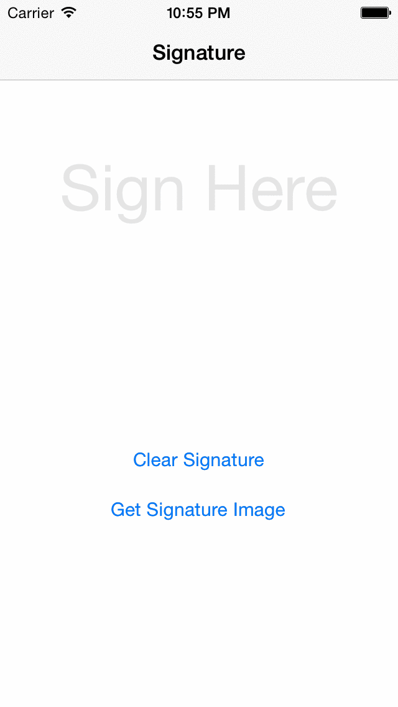

PJR Signature View
=====================

It is a UIView subclass by which you can draw signature and you can also get an image of that signature in your applications.



Why it is useful to you and what is new in it ?
===============================================================

It is a well structured components , The demo contains Model View Controller design pattern,It is using beizer path for drawing signature which is very fast and you can also get image of your signature.

**What is new ?**

It is well structured.
It follows MVC.
It is well designed which contains signature label , so no need to use extra UI for "Sign here" label. You can directly use this componet to any of your applications.
It is created in dynamic way so you can set it according to your view size.


It will definitely make your app much interesting with its animations.


How to use
=====================

**Import this files**

**PJRSignatureView.h , PJRSignatureView.m**


- **Add it into your view controller like:** 

```signatureView= [[PJRSignatureView alloc] initWithFrame:CGRectMake(0, 0, self.view.bounds.size.width, 300)];
[self.view addSubview:signatureView];```

- **Clear drwaing by:** 

```[signatureView clearSignature];```

- **Get signature Image by** 

```[signatureView getSignatureImage];```

- **you can change signature Color By** 

```#define INITIAL_COLOR [UIColor redColor];```
```#define FINAL_COLOR [UIColor redColor];```


     
    
    
License
=====================
Paritosh Raval


